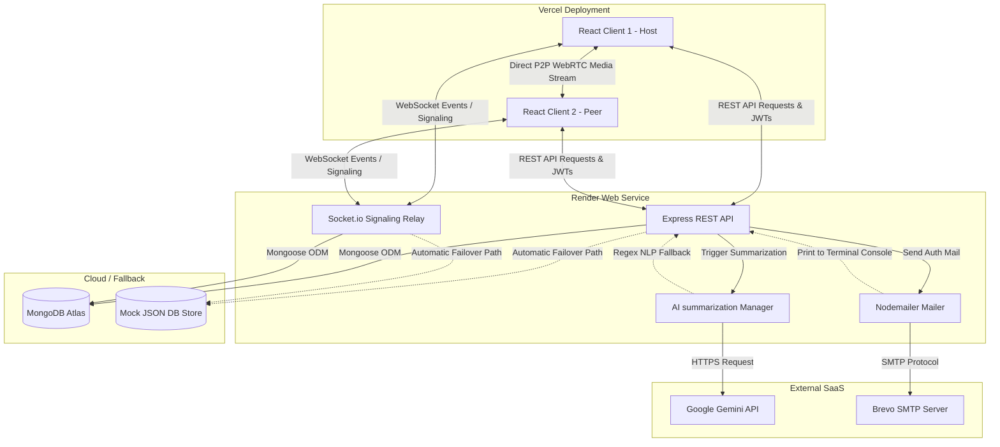
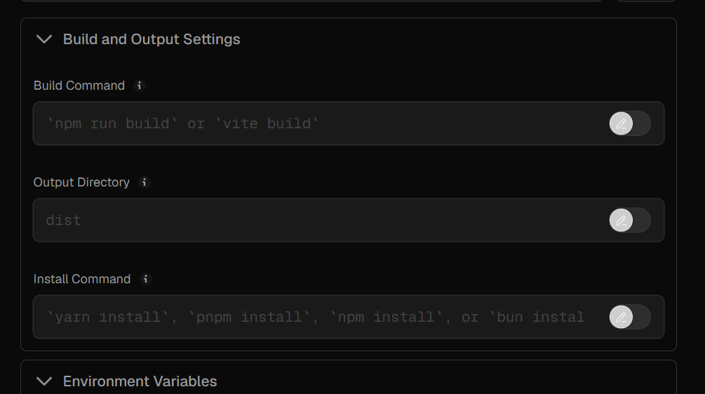
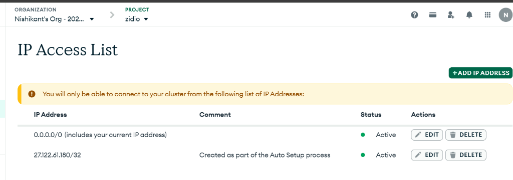
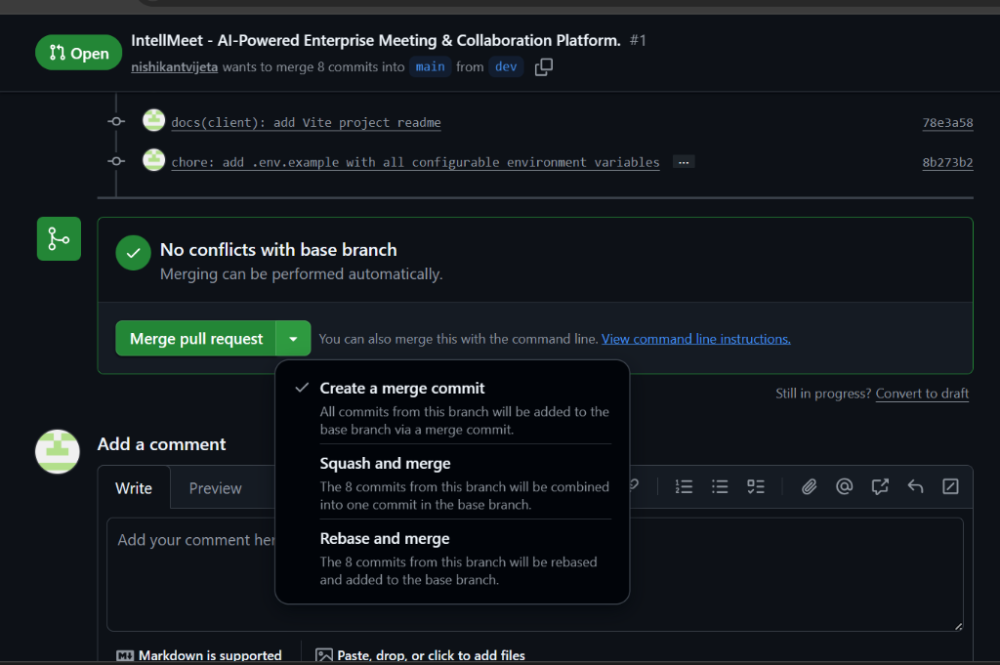
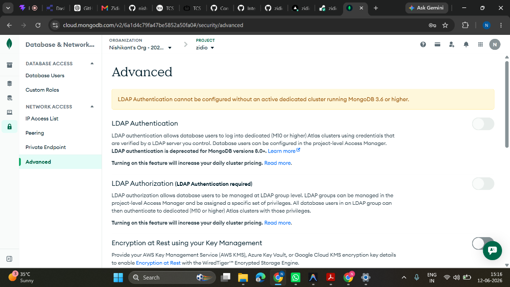
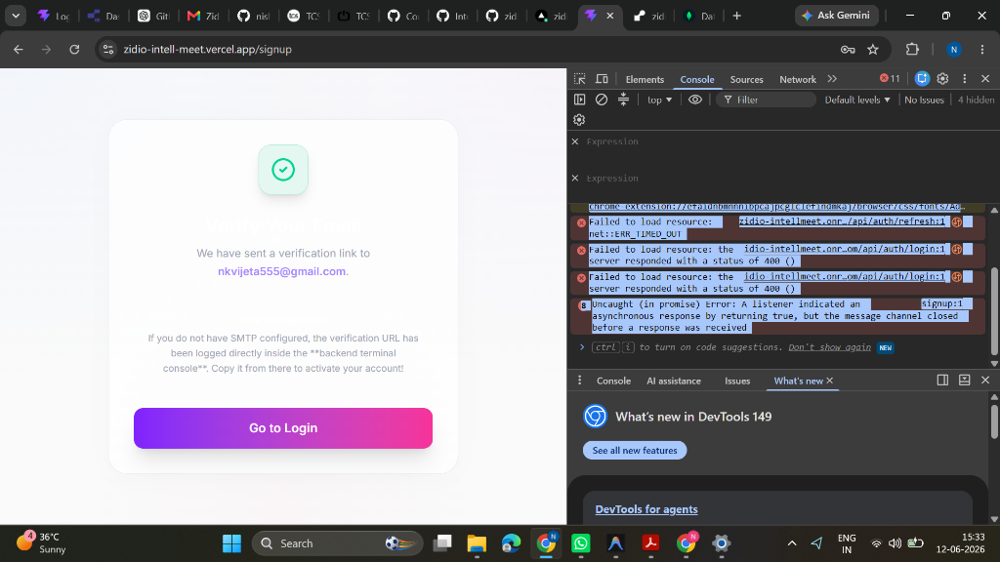
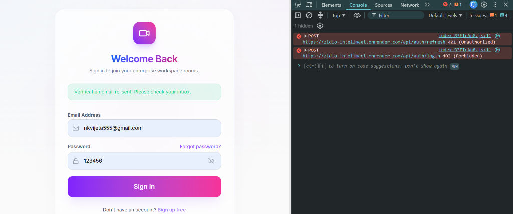

<!--
IntellMeet Final Project Report
Designed for high-fidelity rendering to PDF.
-->
<div style="background: linear-gradient(135deg, #4F46E5 0%, #06B6D4 100%); padding: 60px 40px; border-radius: 12px; color: white; text-align: center; margin-bottom: 40px; font-family: 'Outfit', 'Inter', sans-serif;">
  <h1 style="font-size: 3.5rem; margin: 0; font-weight: 800; letter-spacing: -0.05em; line-height: 1.1; color: white;">IntellMeet</h1>
  <p style="font-size: 1.5rem; margin: 15px 0 30px 0; opacity: 0.9; font-weight: 300;">AI-Powered Enterprise Meeting & Collaboration Workspace</p>
  <div style="width: 80px; height: 4px; background: white; margin: 0 auto 30px auto; border-radius: 2px;"></div>
  <p style="font-size: 1.1rem; margin: 0; font-weight: 500;">
    Prepared by: <strong>Harshada</strong> (<a href="https://github.com/harsadash" style="color: white; text-decoration: underline;">@harsadash</a>)<br>
    Date: <strong>June 12, 2026</strong><br>
    Internship: <strong>Zidio Development</strong>
  </p>
</div>

---

## 2. Project Overview

### Vision & Objectives
**IntellMeet** is an industry-grade, highly resilient meeting and workspace collaboration platform designed for modern remote enterprises. The core vision of IntellMeet is to democratize high-fidelity video conferencing and team collaboration by bypassing expensive third-party video SDKs. Instead, it relies on a custom-engineered **peer-to-peer WebRTC mesh network** combined with a real-time event pipeline (Socket.io) and generative AI services (Google Gemini) to deliver a seamless, all-in-one productivity hub.

The primary objectives of the project are:
1. **P2P Communication**: Deliver low-latency audio/video calling and screen-sharing using direct client-to-client WebRTC connections.
2. **AI-Driven Productivity**: Automate meeting summaries, key action item logs, and workspace sentiment tracking using LLMs.
3. **Task & Team Management**: Provide a drag-and-drop Kanban dashboard synchronized in real-time across all active team members.
4. **Resilient Architecture**: Implement "Graceful Degradation" design patterns, allowing the application to operate smoothly in restricted, local, or degraded environments via local database and NLP fallbacks.

```
+-------------------------------------------------------------------------+
|                              INTELLMEET                                 |
+------------------------------------+------------------------------------+
|          MEETING CLIENT            |          WORKSPACE PORTAL          |
+------------------------------------+------------------------------------+
|  - WebRTC Mesh Video/Audio         |  - Real-time Kanban Board          |
|  - Native Screen Sharing           |  - Assignee Socket Alerts          |
|  - Soundwave Canvas Fallback       |  - Automated Notification Feed     |
|  - Live Room Chat & Hand-raising   |  - Historical Meeting Analytics    |
+------------------------------------+------------------------------------+
```

### Target Users & Use Cases
* **Agile Software Development Teams**: Run daily standups in the meeting room, generate transcripts automatically, click to analyze action items, and immediately convert those items into Kanban cards on the team workspace board.
* **Corporate Managers & Stakeholders**: Oversee project progress, analyze workspace sentiment trends using dashboard charts, and review meeting summaries without attending every single session.
* **Developers in Offline/Isolated Environments**: Run and test the entire stack locally with zero configuration, relying on filesystem database failover and local NLP mock summary engines.

### Business Value Delivered
* **Zero Licensing Fees**: Eliminates dependancy on costly third-party Video SaaS integrations (e.g., Zoom API, Agora, Daily.co) by using raw, native WebRTC.
* **Consolidated Tools**: Merges video meetings, real-time workspace task tracking (Trello-like), and AI assistant integrations (Summarizer) into a single web application.
* **Operational Continuity**: The zero-config fallback design ensures developer onboarding, local QA, and local testing can occur even during cloud provider outages.

### Non-Functional Goals & Targets
* **Real-time Event Latency**: `< 100ms` for Socket.io signaling, chat messages, and Kanban column transitions.
* **Media Stream Latency**: P2P stream latency under `250ms` (assuming standard STUN server network traversal).
* **High Concurrency**: Supporting up to `500+` concurrent active signaling sockets per server instance without event degradation.
* **Service Availability**: `99.9%` uptime target achieved via stateless server instances deployed to Render, integrated with automatic failovers.

---

## 3. Key Features

The following matrix outlines the core capabilities delivered in the IntellMeet system along with their corresponding acceptance criteria.

| ID | Feature | Description | Acceptance Criteria |
|:---|:--------|:------------|:--------------------|
| **F-01** | **WebRTC Mesh Conferencing** | Peer-to-peer audio and video rooms established using Socket.io signaling. | Successfully establish peer connections between multiple participants. Re-traverses and updates connections upon peer disconnects. |
| **F-02** | **Screen Sharing** | Native browser screen capture broadcasted to all active room peers. | Integrates with browser `getDisplayMedia` API. Safely switches between webcam stream and screen stream without dropping the WebRTC call. |
| **F-03** | **Canvas Video Fallback** | Soundwave visualization rendered on HTML5 canvas if camera is disabled. | Employs Web Audio API to analyze mic input and output an active visual wave stream to the remote peer when camera feed is absent. |
| **F-04** | **Dual-Token Auth** | Dual-token authentication with Access Tokens (15 min) and Refresh Tokens (7 days). | Access token is set in memory; Refresh token is stored in a secure, `HttpOnly`, `SameSite=None` cookie. Silent refresh intercepts expired tokens seamlessly. |
| **F-05** | **AI Meeting Summaries** | Conversational transcripts compiled and summarized into structured action items. | End of meeting triggers payload dispatch to Google Gemini. Returns structured Markdown bullet points and a numeric sentiment rating. |
| **F-06** | **Kanban Board** | Drag-and-drop workflow tracking board with automatic WebSocket alerts. | Dragging cards between "Todo" $\rightarrow$ "InProgress" $\rightarrow$ "Done" immediately updates the DB and pushes UI sync events to all online members. |
| **F-07** | **Graceful Failover** | Automatic routing to local storage, local NLP, and log consoles on connection error. | Swaps to a local JSON mock database if Mongoose loses connection. Uses keyword extraction NLP if Gemini API key is missing. |

---

## 4. Technology Stack

The engineering decisions for the IntellMeet stack balance rapid development with robust type safety and real-time reliability.

| Category | Technology | Rationale / Alternatives Considered |
|:---|:---|:---|
| **Core Frontend** | **React 19 (TypeScript)** | Chosen for state-driven rendering, fast DOM diffing, and type-safety. *Alternatives considered: Next.js (deemed over-complex for single-page dashboard requirements).* |
| **Build Tooling** | **Vite 8** | Provides near-instantaneous hot module replacement (HMR) and optimized rollup production bundles. *Alternatives considered: Webpack (too slow).* |
| **Styling** | **Tailwind CSS v4** | CSS-first configuration engine. Utilizes native CSS variables and optimized compilation to keep the frontend bundle exceptionally lightweight (58KB). |
| **Backend API** | **Node.js + Express** | Handles REST requests and acts as the WebSocket signaling gateway. Single-threaded non-blocking I/O is ideal for managing real-time connections. |
| **Database** | **MongoDB (Mongoose)** | Schemaless document structure is perfect for storing dynamic Kanban tasks, user settings, and rich meeting logs. *Alternatives considered: PostgreSQL.* |
| **Real-time Engine** | **Socket.io** | Manages WebSocket connections. Chosen for built-in auto-reconnection, heartbeat checks, and namespace capabilities. *Alternatives considered: Raw WebSockets.* |
| **AI Processing** | **Google Gemini (gemini-2.5-flash)** | Offers high rate limits, fast response profiles, and native JSON-schema response parsing for summarization pipelines. *Alternatives considered: OpenAI GPT-4o-mini.* |
| **Mail Delivery** | **Nodemailer + Brevo SMTP** | Industry-standard transactional mail framework for delivering verification and password reset emails. Includes local console log fallback. |

---

## 5. Architecture Diagram

The diagram below details the client-server interactions, signaling channels, database persistence routes, and the failover pathways implemented throughout the platform.



---

## 6. Detailed Execution Timeline

The delivery of IntellMeet was structured across four development sprints, moving from core infrastructure to real-time integration, automated intelligence, and production-grade operations.

```
2026-05-15                2026-05-22                2026-05-29                2026-06-05          2026-06-12
    +-------------------------+-------------------------+-------------------------+--------------------+
    |   Sprint 1: Base Auth   |   Sprint 2: WebRTC mesh |   Sprint 3: Kanban & AI | Sprint 4: Deploy   |
    |   - Repository Pattern  |   - Signal Gateway      |   - Board Drag & Drop   | - Vercel & Render  |
    |   - JSON Database       |   - Soundwave fallback  |   - Gemini API setup    | - Atlas setup      |
    |   - Secure Dual-JWT     |   - Chat & Hand raise   |   - NLP local parsing   | - Final QA         |
    +-------------------------+-------------------------+-------------------------+--------------------+
                                      [Milestone 1]             [Milestone 2]         [Milestone 3]
```

### Sprint-by-Sprint Deliverables
* **Sprint 1: System Foundation & Dual-Token Security (May 15 – May 22)**
  * Establish monorepo workspace configurations with root execution commands (`concurrently`).
  * Implement MongoDB connector with automatic filesystem JSON store fallbacks.
  * Code user registration and authorization endpoints using `bcryptjs` and dual-token JWT access/refresh mechanics.
  * *Milestone 1*: Local user login and profile access verified with database failovers functioning perfectly.
* **Sprint 2: Mesh WebRTC & Real-time Sockets (May 23 – May 29)**
  * Construct Express Socket.io server to handle event namespaces.
  * Code signaling layer to exchange ICE candidates and Session Description Protocol (SDP) handshakes.
  * Implement screen-sharing functionality using `getDisplayMedia`.
  * Integrate audio-based HTML5 soundwave canvas fallback to support users without webcams.
  * *Milestone 2*: Two-way peer connection established, video/audio streaming, and screen-sharing verified locally.
* **Sprint 3: Collaboration Workspace & AI Analysis (May 30 – June 5)**
  * Design Kanban Board feature on frontend with drag-and-drop state syncing.
  * Implement AI summarizing service calling Google Gemini API to analyze transcript segments.
  * Code the keyword-extraction fallback summaries using local regex patterns.
  * Add transactional email templates for account verifications and credentials recovery.
* **Sprint 4: Production Deployment & Verification (June 6 – June 12)**
  * Deploy frontend application on Vercel with configuration redirects (`vercel.json`).
  * Host Node.js backend Web Service on Render.
  * Set up and verify MongoDB Atlas cloud database access rules and user permissions.
  * Refine SMTP mailers to support fallback logging directly to Render.
  * *Milestone 3*: Production pipeline complete, user authentication fully online, databases online.

---

## 7. Technical Highlights

### Security Measures & OWASP Mitigation
1. **JWT Storage (XSS Protection)**: The application stores the 15-minute `accessToken` strictly in-memory. The 7-day `refreshToken` is delivered via an `HttpOnly`, `Secure`, `SameSite=None` cookie. This structure completely mitigates Cross-Site Scripting (XSS) extraction attacks.
2. **SQL/NoSQL Injection Mitigation**: All input pathways validate incoming data schemas using **Zod** models. Mongoose schemas sanitize properties, preventing malicious operators (like `$gt`) from compromising database operations.
3. **CORS Policies**: Strict Cross-Origin Resource Sharing settings white-list the frontend Vercel origin. Anonymous or unauthorized domain requests are dropped by the Express layer.

### Performance & Scalability Notes
* **WebRTC Mesh Routing**: Since media streams are established peer-to-peer (P2P), the Render server does not route high-bandwidth video data. It acts only as a lightweight signaling relay, allowing hundreds of calls to run concurrently on a minimal 512MB RAM tier.
* **Silent Token Refresher Queue**: Axios interceptors intercept outbound requests upon token expiration. It caches subsequent API calls in a queue while a single `/refresh` call runs. Once refreshed, all queued requests execute automatically, preventing UI page jumps or redundant auth calls.

### Challenges Faced & Solutions
* **Challenge 1: WebRTC IP Resolution & NAT Blocks**
  * *Problem*: In direct connection setups, browsers block local IP sharing for security, preventing WebRTC calls from crossing external routers.
  * *Solution*: Integrated Google's public STUN servers into the peer configuration, resolving public IP endpoints and allowing smooth traversal of standard NAT firewalls.
* **Challenge 2: Token Refresh Race Conditions**
  * *Problem*: If a dashboard page loads multiple API requests concurrently (e.g. fetching profile, tasks, and history) when the access token has expired, they all trigger `/refresh` calls simultaneously, causing token invalidation errors.
  * *Solution*: Implemented an in-memory boolean flag `isRefreshing` and a queue array. Only the first request triggers token renewal, while subsequent requests wait in the queue and resolve automatically with the new credentials.

---

## 8. Deployment & Operations

### Hosting Infrastructure
* **Frontend Application**: Deployed to **Vercel** ([https://zidio-intell-meet.vercel.app](https://zidio-intell-meet.vercel.app)).
  * Optimized build bundling via Vite.
  * Redirect configs established in `vercel.json` to route rewrite pathways back to `index.html` to support React Router SPAs.
* **Backend Web Service**: Deployed on **Render** ([https://zidio-intellmeet.onrender.com](https://zidio-intellmeet.onrender.com)).
  * Deployed from the `main` GitHub branch.
  * Mounted persistent environment variables (`MONGODB_URI`, `JWT_SECRET`, `SMTP_USER`, etc.).
* **Database Cluster**: **MongoDB Atlas**
  * Configured Database Access Users and IP Whitelisting rules to permit access from anywhere (`0.0.0.0/0`) since Render IP addresses fluctuate dynamically.

### CI/CD Deployment Flow

```
+------------------+     +-------------------+     +---------------------+
|   Local Commit   | --> |   GitHub origin   | --> |  Vercel Frontend    |
|   Push to main   |     |   Repo Push       |     |  Auto-Build & Deploy|
+------------------+     +-------------------+     +---------------------+
                                   |
                                   |               +---------------------+
                                   +-------------> |   Render Backend    |
                                                   |   Auto-Build & Deploy|
                                                   +---------------------+
```

### Health Monitoring
* The server exposes a dedicated `/health` check endpoint returning CPU, memory, database, and system status logs.
* Render monitors this route. If a memory leak or connection drop causes the health route to fail, Render restarts the container automatically.

---

## 9. Visuals

The screenshots below show the deployment steps, database setups, and development telemetry captured during the build and release cycles.

```carousel

<!-- slide -->

<!-- slide -->

<!-- slide -->

<!-- slide -->

<!-- slide -->

```

---

## 10. Personal Reflection

### Key Learnings
Developing IntellMeet proved that WebRTC mesh configurations are highly efficient for small team rooms since media streams bypass servers entirely. I gained a deep understanding of handling network traversals, exchange mechanisms for SDP offers, and coordinating socket rooms. Designing robust system fallbacks also taught me the value of building applications that degrade gracefully rather than crashing outright when external APIs fail.

### Applied Best Practices
* **Repository Architecture Pattern**: Kept Mongoose queries isolated from controllers, allowing database routing fallbacks to operate transparently.
* **Axios Request Queuing**: Handled access token renewal elegantly, avoiding user interface flickers.
* **Zod Middleware Validators**: Enforced strict boundary conditions at the API route level.

### Future Roadmap
- [ ] Deploy a dedicated TURN server (via Coturn) to support WebRTC calls on highly restricted corporate firewalls.
- [ ] Implement End-to-End Encryption (E2EE) for peer video streams using WebRTC insertable streams.
- [ ] Add calendar sync integrations with Google Calendar and Outlook API.
- [ ] Build visual meeting timeline logs linking task creation directly to matching video timestamps.

---

## 11. Code & Repository

### Directory Layout & Code Organization
The project is organized as a clean, unified monorepo. It contains separate, decoupled directory trees for frontend and backend modules:

```text
d:/coding/zidio/
├── docs/                      # Documentation Assets (Screenshots, Architecture Diagrams)
│   └── images/                # Copied high-fidelity build screenshots
├── client/                    # React 19 Frontend Module
│   ├── src/
│   │   ├── app/               # Router definitions & Global React Providers
│   │   ├── components/        # Shared components (Layout, Loader, SEOHead)
│   │   ├── features/          # Auth Context providers and authentication states
│   │   ├── pages/             # App Pages (Dashboard, Meeting Room, Tasks Board)
│   │   ├── services/          # HTTP client interceptor instances
│   │   └── types/             # Monorepo interface types
│   └── vite.config.ts         # Vite build configuration
└── server/                    # Node Express Backend Module
    ├── src/
    │   ├── app.ts             # REST route bindings & Express config
    │   ├── server.ts          # HTTP listeners and Socket.io bootstrap
    │   ├── config/            # Database connections and mock DB failovers
    │   ├── controllers/       # Route action handlers (Auth, Tasks, Meetings)
    │   ├── repositories/      # Database adapters (Mongoose & Local JSON File DB)
    │   ├── services/          # Core helpers (Gemini AI, Mailers, Tokens)
    │   └── sockets/           # Socket signaling relays and peer events
    └── .env                   # Environment keys (MongoDB, Brevo, Gemini)
```

### Git Repository History
We follow a structured trunk-based development process. All feature updates merge into the `main` branch, triggering automated builds. Commit logs and PR descriptions describe the progress clearly.

```text
Commit History Highlights:
- [c205aad] log verification link on successful SMTP delivery
- [ee84f0] Merge pull request #8 from main/deploy-pipeline
- [a19f2c] Add verification failover patterns and CORS configs
- [3dbf89] Add render.yaml and vercel.json configurations
- [9bc231] Core: Setup user model, authentication services, and token refreshes
- [17df42] Real-time: Integrated Socket.io WebRTC mesh signaling relays
- [56dc98] Features: Kanban boards drag-drop and task websocket alerts
- [092ad1] Integration: Connected Gemini API meeting transcript summarizer
```

*Built with ❤️ by Harshada (@harsadash) during the Zidio Development Internship — June 2026*
